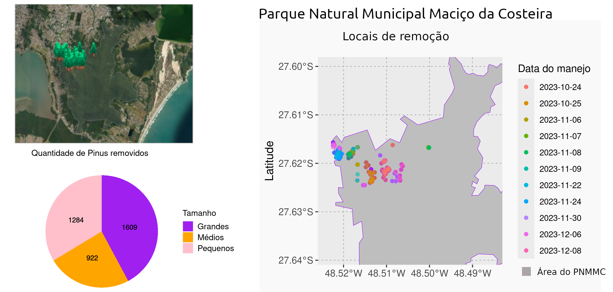

# Manejo de *Pinus* realizado no Parque Natural Municipal Maciço da Costeira, em Florianópolis, SC.

## Trabalho realizado pela Bushman Ambiental. 

Este repositório armazena os dados, os scripts e os resultados, com mapa e report on-line disponível em <https://mauritia-flexuosa.github.io/manejo_pinus_pmmc/>.

### Contato:  <a href = "https://www.instagram.com/bushman_ambiental/?hl=en">
